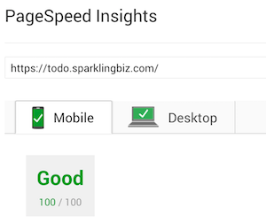
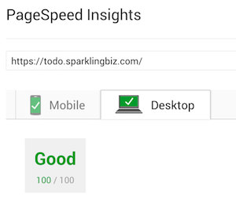

# TodoMVC Rails React

todomvc.com example built using rails 5, [webpacker](https://github.com/rails/webpacker) and react.

## Development

```
bundle install
cd vendor && yarn install && cd ..
foreman start
open http://localhost:5000/
```

If you wanna simulate a production environment compile the assets and run in production environment

```bash
rake assets:precompile # will compile webpack too
RAILS_SERVE_STATIC_FILES=true SECRET_KEY_BASE="secretkey" RAILS_ENV=production rails s -b 0.0.0.0 -p 5000
```

## TODO

The code is port of a v0.13 react version, so I intend to make it follow the best practices described on v15 documentation.

- [X] Add system tests
- [ ] Add redux and rails API
  - [ ] REST
  - [ ] GraphQL

## Performance

This project is using `react-rails` to deliver the component rendered on the server side (Server Side Rendering), also applied some techniques to make Google happy and get a 100 grade on Google PageSpeed Insights




## Thanks

Based on original work [todomvc react](https://github.com/tastejs/todomvc/tree/gh-pages/examples/react) created by [petehunt](http://github.com/petehunt/).
